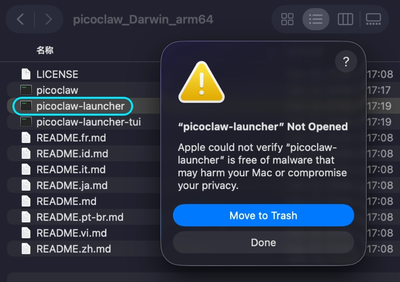
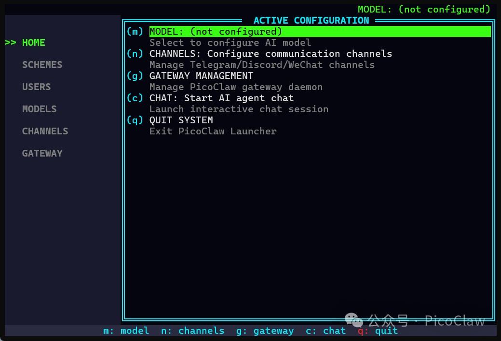

<div align="center">
<<<<<<< HEAD
  

  <h1>PicoClaw: Pembantu AI Sangat Efisien dalam Go</h1>

  <h3>Perkakasan $10 · RAM <10MB · Boot <1s · 皮皮虾，我们走！</h3>
=======


<h1>PicoClaw: Pembantu AI Ultra-Cekap dalam Go</h1>

<h3>Perkakasan $10 · RAM 10MB · Boot ms · Jom, PicoClaw!</h3>
>>>>>>> 836cbc3 (docs: add Malay README and docs, add v0.2.4 news to all languages)
  <p>
    
    
    
    <br>
    <a href="https://picoclaw.io"></a>
    <a href="https://docs.picoclaw.io/"></a>
    <a href="https://deepwiki.com/sipeed/picoclaw"></a>
    <br>
    <a href="https://x.com/SipeedIO"></a>
    <a href="./assets/wechat.png"></a>
    <a href="https://discord.gg/V4sAZ9XWpN"></a>
  </p>

<<<<<<< HEAD
[中文](README.zh.md) | [日本語](README.ja.md) | [Português](README.pt-br.md) | [Tiếng Việt](README.vi.md) | [Français](README.fr.md) | [Italiano](README.it.md) | [English](README.md) | **Bahasa Melayu**
=======
[中文](README.zh.md) | [日本語](README.ja.md) | [Português](README.pt-br.md) | [Tiếng Việt](README.vi.md) | [Français](README.fr.md) | [Italiano](README.it.md) | [Bahasa Indonesia](README.id.md) | **Malay** | [English](README.md)
>>>>>>> 836cbc3 (docs: add Malay README and docs, add v0.2.4 news to all languages)

</div>

---

<<<<<<< HEAD
> **PicoClaw** ialah projek sumber terbuka bebas yang dimulakan oleh [Sipeed](https://sipeed.com). Ia ditulis sepenuhnya dalam **Go** — bukan fork OpenClaw, NanoBot, atau mana-mana projek lain.

🦐 PicoClaw ialah Pembantu AI peribadi yang sangat ringan, diinspirasikan oleh [NanoBot](https://github.com/HKUDS/nanobot), dan dibina semula sepenuhnya dalam Go melalui proses bootstrap kendiri, di mana agen AI itu sendiri memacu keseluruhan migrasi seni bina dan pengoptimuman kod.

⚡️ Berjalan pada perkakasan $10 dengan RAM <10MB: Itu 99% kurang penggunaan memori berbanding OpenClaw dan 98% lebih murah berbanding Mac mini!

<table align="center">
  <tr align="center">
    <td align="center" valign="top">
      <p align="center">
        
      </p>
    </td>
    <td align="center" valign="top">
      <p align="center">
        
      </p>
    </td>
  </tr>
</table>

> [!CAUTION]
> **🚨 KESELAMATAN & SALURAN RASMI / 安全声明**
>
> * **TIADA KRIPTO:** PicoClaw **TIADA** token/coin rasmi. Semua dakwaan di `pump.fun` atau platform dagangan lain ialah **PENIPUAN**.
>
> * **DOMAIN RASMI:** Satu-satunya laman web rasmi ialah **[picoclaw.io](https://picoclaw.io)**, dan laman web syarikat ialah **[sipeed.com](https://sipeed.com)**
> * **Amaran:** Banyak domain `.ai/.org/.com/.net/...` didaftarkan oleh pihak ketiga.
> * **Amaran:** picoclaw masih dalam pembangunan awal dan mungkin mempunyai isu keselamatan rangkaian yang belum diselesaikan. Jangan deploy ke persekitaran produksi sebelum keluaran v1.0.
> * **Nota:** picoclaw baru-baru ini telah menggabungkan banyak PR, yang mungkin menyebabkan penggunaan memori lebih besar (10–20MB) dalam versi terkini. Kami bercadang mengutamakan pengoptimuman sumber sebaik sahaja set ciri semasa mencapai keadaan stabil.

## 📢 Berita

2026-03-17 🚀 **v0.2.3 Dikeluarkan!** UI system tray (Windows & Linux), penjejakan status sub-agen (`spawn_status`), hot-reload gateway eksperimen, gerbang keselamatan cron, dan 2 pembaikan keselamatan. PicoClaw kini mencecah **25K ⭐**!

2026-03-09 🎉 **v0.2.1 — Kemas kini terbesar setakat ini!** Sokongan protokol MCP, 4 saluran baharu (Matrix/IRC/WeCom/Discord Proxy), 3 penyedia baharu (Kimi/Minimax/Avian), pipeline vision, stor memori JSONL, dan routing model.

2026-02-28 📦 **v0.2.0** dikeluarkan dengan sokongan Docker Compose dan pelancar Web UI.

2026-02-26 🎉 PicoClaw mencapai **20K stars** dalam hanya 17 hari! Auto-orchestration saluran dan antara muka capability telah tiba.

<details>
<summary>Berita lama...</summary>

2026-02-16 🎉 PicoClaw mencapai 12K stars dalam seminggu! Peranan penyelenggara komuniti dan [roadmap](ROADMAP.md) telah disiarkan secara rasmi.

2026-02-13 🎉 PicoClaw mencapai 5000 stars dalam 4 hari! Roadmap projek dan kumpulan pembangun sedang disusun.

2026-02-09 🎉 **PicoClaw Dilancarkan!** Dibina dalam 1 hari untuk membawa AI Agents ke perkakasan $10 dengan RAM <10MB. 🦐 PicoClaw, jom pergi!
=======
> **PicoClaw** adalah projek sumber terbuka bebas yang dilancarkan oleh [Sipeed](https://sipeed.com), ditulis sepenuhnya dalam **Go** dari awal — bukan cabang OpenClaw, NanoBot, atau projek lain.

**PicoClaw** adalah pembantu AI peribadi ultra-ringan yang terinspirasi oleh [NanoBot](https://github.com/HKUDS/nanobot). Ia dibina semula dari awal dalam **Go** melalui proses "self-bootstrapping" — AI Agent itu sendiri yang memacu migrasi seni bina dan pengoptimuman kod.

**Berjalan pada perkakasan $10 dengan RAM <10MB** — 99% lebih sedikit memori daripada OpenClaw dan 98% lebih murah daripada Mac mini!

<table align="center">
<tr align="center">
<td align="center" valign="top">
<p align="center">

</p>
</td>
<td align="center" valign="top">
<p align="center">

</p>
</td>
</tr>
</table>

> [!CAUTION]
> **Notis Keselamatan**
>
> * **TIADA KRIPTO:** PicoClaw **tidak** mengeluarkan sebarang token atau mata wang kripto rasmi. Semua tuntutan di `pump.fun` atau platform dagangan lain adalah **penipuan**.
> * **DOMAIN RASMI:** Satu-satunya laman web rasmi ialah **[picoclaw.io](https://picoclaw.io)**, dan laman web syarikat ialah **[sipeed.com](https://sipeed.com)**
> * **BERHATI-HATI:** Banyak domain `.ai/.org/.com/.net/...` telah didaftarkan oleh pihak ketiga. Jangan percayai mereka.
> * **NOTA:** PicoClaw dalam pembangunan pesat awal. Mungkin terdapat isu keselamatan yang belum diselesaikan. Jangan deploy ke pengeluaran sebelum v1.0.


## 📢 Berita

2026-03-25 🚀 **v0.2.4 Dikeluarkan!** Penstrukturan semula seni bina Agent (SubTurn, Hooks, Steering, EventBus), integrasi WeChat/WeCom, penguatan keselamatan (.security.yml, penapisan data sensitif), penyedia baharu (AWS Bedrock, Azure, Xiaomi MiMo), dan 35 pembetulan pepijat. PicoClaw mencapai **26K Stars**!

2026-03-17 🚀 **v0.2.3 Dikeluarkan!** UI dulang sistem (Windows & Linux), pertanyaan status sub-agent (`spawn_status`), muat semula panas Gateway eksperimental, kawalan keselamatan Cron, dan 2 pembetulan keselamatan. PicoClaw mencapai **25K Stars**!

2026-03-09 🎉 **v0.2.1 — Kemas kini terbesar setakat ini!** Sokongan protokol MCP, 4 saluran baharu (Matrix/IRC/WeCom/Discord Proxy), 3 penyedia baharu (Kimi/Minimax/Avian), saluran paip visi, storan memori JSONL, penghalaan model.

2026-02-28 📦 **v0.2.0** dikeluarkan dengan sokongan Docker Compose dan Pelancar Web UI.

<details>
<summary>Berita terdahulu...</summary>

2026-02-26 🎉 PicoClaw mencapai **20K Stars** hanya dalam 17 hari! Orkestrasi saluran automatik dan antara muka keupayaan kini aktif.

2026-02-16 🎉 PicoClaw melepasi 12K Stars dalam seminggu! Peranan penyelenggara komuniti dan [Peta Jalan](ROADMAP.md) dilancarkan secara rasmi.

2026-02-13 🎉 PicoClaw melepasi 5000 Stars dalam 4 hari! Peta jalan projek dan kumpulan pembangun sedang dalam proses.

2026-02-09 🎉 **PicoClaw Dikeluarkan!** Dibina dalam 1 hari untuk membawa AI Agent ke perkakasan $10 dengan RAM <10MB. Jom, PicoClaw!
>>>>>>> 836cbc3 (docs: add Malay README and docs, add v0.2.4 news to all languages)

</details>

## ✨ Ciri-ciri

<<<<<<< HEAD
🪶 **Sangat Ringan**: Penggunaan memori <10MB — 99% lebih kecil daripada fungsi teras OpenClaw.*

💰 **Kos Minimum**: Cukup efisien untuk berjalan pada perkakasan $10 — 98% lebih murah daripada Mac mini.

⚡️ **Sangat Pantas**: Masa startup 400X lebih pantas, but dalam <1 saat walaupun pada teras tunggal 0.6GHz.

🌍 **Portabiliti Sebenar**: Satu binari self-contained merentas RISC-V, ARM, MIPS, dan x86, satu klik untuk terus berjalan!

🤖 **Dibootstrapping oleh AI**: Pelaksanaan Go-native autonomi — 95% teras dijana oleh Agent dengan penambahbaikan human-in-the-loop.

🔌 **Sokongan MCP**: Integrasi asli [Model Context Protocol](https://modelcontextprotocol.io/) — sambungkan mana-mana pelayan MCP untuk melanjutkan keupayaan agen.

👁️ **Pipeline Vision**: Hantar imej dan fail terus kepada agen — pengekodan base64 automatik untuk LLM multimodal.

🧠 **Routing Pintar**: Routing model berasaskan peraturan — pertanyaan mudah pergi ke model ringan, menjimatkan kos API.

_*Versi terkini mungkin menggunakan 10–20MB disebabkan banyak gabungan ciri yang pantas. Pengoptimuman sumber dirancang. Perbandingan startup berdasarkan penanda aras teras tunggal 0.8GHz (lihat jadual di bawah)._

|                                | OpenClaw      | NanoBot                        | **PicoClaw**                                   |
| ------------------------------ | ------------- | ------------------------------ | ---------------------------------------------- |
| **Bahasa**                     | TypeScript    | Python                         | **Go**                                         |
| **RAM**                        | >1GB          | >100MB                         | **< 10MB***                                    |
| **Startup**</br>(teras 0.8GHz) | >500s         | >30s                           | **<1s**                                        |
| **Kos**                        | Mac Mini $599 | Kebanyakan Linux SBC </br>~$50 | **Mana-mana papan Linux**</br>**Serendah $10** |


=======
🪶 **Ultra-ringan**: Jejak memori teras <10MB — 99% lebih kecil daripada OpenClaw.*

💰 **Kos minimum**: Cukup cekap untuk berjalan pada perkakasan $10 — 98% lebih murah daripada Mac mini.

⚡️ **Boot kilat**: 400x lebih pantas. Boot dalam <1s walaupun pada pemproses teras tunggal 0.6GHz.

🌍 **Benar-benar mudah alih**: Binari tunggal merentasi seni bina RISC-V, ARM, MIPS, dan x86.

🤖 **Dibantu AI**: Pelaksanaan Go tulen — 95% kod teras dijana oleh Agent dan diperhalusi melalui semakan manusia.

🔌 **Sokongan MCP**: Integrasi [Model Context Protocol](https://modelcontextprotocol.io/) natif.

👁️ **Saluran paip visi**: Hantar imej dan fail terus ke Agent — pengekodan base64 automatik untuk LLM multimodal.

🧠 **Penghalaan pintar**: Penghalaan model berasaskan peraturan — pertanyaan mudah ke model ringan, menjimatkan kos API.

_*Binaan terkini mungkin menggunakan 10-20MB disebabkan penggabungan PR yang pesat. Pengoptimuman sumber dirancang. Perbandingan kelajuan boot berdasarkan penanda aras teras tunggal 0.8GHz (lihat jadual di bawah)._

<div align="center">

|                                | OpenClaw      | NanoBot                  | **PicoClaw**                           |
| ------------------------------ | ------------- | ------------------------ | -------------------------------------- |
| **Bahasa**                     | TypeScript    | Python                   | **Go**                                 |
| **RAM**                        | >1GB          | >100MB                   | **< 10MB***                            |
| **Masa Boot** (teras 0.8GHz)   | >500s         | >30s                     | **<1s**                                |
| **Kos**                        | Mac Mini $599 | Kebanyakan papan Linux ~$50 | **Mana-mana papan Linux dari $10**  |


</div>

> **[Senarai Keserasian Perkakasan](docs/hardware-compatibility.md)** — Lihat semua papan yang diuji, dari RISC-V $5 hingga Raspberry Pi hingga telefon Android.

<p align="center">

</p>

>>>>>>> 836cbc3 (docs: add Malay README and docs, add v0.2.4 news to all languages)
## 🦾 Demonstrasi

### 🛠️ Aliran Kerja Pembantu Standard

<table align="center">
<<<<<<< HEAD
  <tr align="center">
    <th><p align="center">🧩 Jurutera Full-Stack</p></th>
    <th><p align="center">🗂️ Pengurusan Log & Perancangan</p></th>
    <th><p align="center">🔎 Carian Web & Pembelajaran</p></th>
  </tr>
  <tr>
    <td align="center"><p align="center"></p></td>
    <td align="center"><p align="center"></p></td>
    <td align="center"><p align="center"></p></td>
  </tr>
  <tr>
    <td align="center">Bangunkan • Deploy • Skalakan</td>
    <td align="center">Jadual • Automasi • Memori</td>
    <td align="center">Penemuan • Insight • Trend</td>
  </tr>
</table>

### 📱 Jalankan pada Telefon Android Lama

Berikan telefon lama anda hayat kedua! Tukarkannya menjadi Pembantu AI pintar dengan PicoClaw. Permulaan pantas:

1. **Pasang [Termux](https://github.com/termux/termux-app)** (Muat turun dari [GitHub Releases](https://github.com/termux/termux-app/releases), atau cari di F-Droid / Google Play).
2. **Jalankan arahan**

```bash
# Download the latest release from https://github.com/sipeed/picoclaw/releases
wget https://github.com/sipeed/picoclaw/releases/latest/download/picoclaw_Linux_arm64.tar.gz
tar xzf picoclaw_Linux_arm64.tar.gz
pkg install proot
termux-chroot ./picoclaw onboard
```

Selepas itu, ikut arahan dalam bahagian "Quick Start" untuk melengkapkan konfigurasi!


### 🐜 Deploy Jejak Sumber Rendah yang Inovatif

PicoClaw boleh dideploy pada hampir mana-mana peranti Linux!

- $9.9 [LicheeRV-Nano](https://www.aliexpress.com/item/1005006519668532.html) versi E(Ethernet) atau W(WiFi6), untuk pembantu rumah minimum
- $30~50 [NanoKVM](https://www.aliexpress.com/item/1005007369816019.html), atau $100 [NanoKVM-Pro](https://www.aliexpress.com/item/1005010048471263.html) untuk penyelenggaraan pelayan automatik
- $50 [MaixCAM](https://www.aliexpress.com/item/1005008053333693.html) atau $100 [MaixCAM2](https://www.kickstarter.com/projects/zepan/maixcam2-build-your-next-gen-4k-ai-camera) untuk pemantauan pintar

<https://private-user-images.githubusercontent.com/83055338/547056448-e7b031ff-d6f5-4468-bcca-5726b6fecb5c.mp4>

🌟 Lebih banyak senario deployment sedang menanti!

## 📦 Pemasangan

### Pasang dengan binari prabina

Muat turun binari untuk platform anda dari halaman [Releases](https://github.com/sipeed/picoclaw/releases).

### Pasang dari sumber (ciri terkini, disyorkan untuk pembangunan)

```bash
git clone https://github.com/sipeed/picoclaw.git

cd picoclaw
make deps

# Build, no need to install
make build

# Build for multiple platforms
make build-all

# Build for Raspberry Pi Zero 2 W (32-bit: make build-linux-arm; 64-bit: make build-linux-arm64)
make build-pi-zero

# Build And Install
make install
```

**Raspberry Pi Zero 2 W:** Gunakan binari yang sepadan dengan OS anda: Raspberry Pi OS 32-bit → `make build-linux-arm`; 64-bit → `make build-linux-arm64`. Atau jalankan `make build-pi-zero` untuk membina kedua-duanya.

## 📚 Dokumentasi

Untuk panduan terperinci, lihat dokumen di bawah. README hanya meliputi quick start.

| Topik                                                 | Penerangan                                                                                          |
| ----------------------------------------------------- | --------------------------------------------------------------------------------------------------- |
| 🐳 [Docker & Quick Start](docs/my/docker.md)           | Setup Docker Compose, mod Launcher/Agent, konfigurasi Quick Start                                   |
| 💬 [Aplikasi Sembang](docs/my/chat-apps.md)            | Telegram, Discord, WhatsApp, Matrix, QQ, Slack, IRC, DingTalk, LINE, Feishu, WeCom, dan banyak lagi |
| ⚙️ [Konfigurasi](docs/my/configuration.md)             | Pemboleh ubah persekitaran, susun atur workspace, sumber skill, security sandbox, heartbeat         |
| 🔌 [Penyedia & Model](docs/my/providers.md)            | 20+ penyedia LLM, routing model, konfigurasi model_list, seni bina penyedia                         |
| 🔄 [Spawn & Tugasan Async](docs/my/spawn-tasks.md)     | Tugasan cepat, tugasan panjang dengan spawn, orkestrasi sub-agen async                              |
| 🐛 [Penyelesaian Masalah](docs/my/troubleshooting.md)  | Masalah lazim dan penyelesaiannya                                                                   |
| 🔧 [Konfigurasi Tools](docs/my/tools_configuration.md) | Hidup/mati per tool, polisi exec                                                                    |

##  Sertai Rangkaian Sosial Agent

Sambungkan Picoclaw ke Rangkaian Sosial Agent hanya dengan menghantar satu mesej melalui CLI atau mana-mana Aplikasi Sembang yang disepadukan.

**Baca `https://clawdchat.ai/skill.md` dan ikut arahan untuk menyertai [ClawdChat.ai](https://clawdchat.ai)**

## 🖥️ Rujukan CLI

| Arahan                    | Penerangan                      |
| ------------------------- | ------------------------------- |
| `picoclaw onboard`        | Inisialisasi config & workspace |
| `picoclaw agent -m "..."` | Berbual dengan agen             |
| `picoclaw agent`          | Mod sembang interaktif          |
| `picoclaw gateway`        | Mulakan gateway                 |
| `picoclaw status`         | Papar status                    |
| `picoclaw version`        | Papar info versi                |
| `picoclaw cron list`      | Senaraikan semua job berjadual  |
| `picoclaw cron add ...`   | Tambah job berjadual            |
| `picoclaw cron disable`   | Nyahaktifkan job berjadual      |
| `picoclaw cron remove`    | Buang job berjadual             |
| `picoclaw skills list`    | Senaraikan skill yang dipasang  |
| `picoclaw skills install` | Pasang skill                    |
| `picoclaw migrate`        | Migrasi data dari versi lama    |
| `picoclaw auth login`     | Autentikasi dengan penyedia     |

### Tugasan Berjadual / Peringatan

PicoClaw menyokong peringatan berjadual dan tugasan berulang melalui tool `cron`:

* **Peringatan sekali**: "Ingatkan saya dalam 10 minit" → dicetus sekali selepas 10 minit
* **Tugasan berulang**: "Ingatkan saya setiap 2 jam" → dicetus setiap 2 jam
* **Ungkapan cron**: "Ingatkan saya pada 9 pagi setiap hari" → menggunakan ungkapan cron

## 🤝 Sumbangan & Roadmap

PR amat dialu-alukan! Kod asas ini sengaja kecil dan mudah dibaca. 🤗

Lihat [Roadmap Komuniti](https://github.com/sipeed/picoclaw/blob/main/ROADMAP.md) penuh kami.

Kumpulan pembangun sedang dibina, sertai selepas PR pertama anda digabungkan!

Kumpulan pengguna:

discord: <https://discord.gg/V4sAZ9XWpN>


=======
<tr align="center">
<th><p align="center">Mod Jurutera Full-Stack</p></th>
<th><p align="center">Pengelogan & Perancangan</p></th>
<th><p align="center">Carian Web & Pembelajaran</p></th>
</tr>
<tr>
<td align="center"><p align="center"></p></td>
<td align="center"><p align="center"></p></td>
<td align="center"><p align="center"></p></td>
</tr>
<tr>
<td align="center">Bangun · Deploy · Skala</td>
<td align="center">Jadual · Automatik · Ingat</td>
<td align="center">Temui · Wawasan · Trend</td>
</tr>
</table>

### 🐜 Deployment Jejak Rendah yang Inovatif

PicoClaw boleh digunakan pada hampir mana-mana peranti Linux!

- $9.9 [LicheeRV-Nano](https://www.aliexpress.com/item/1005006519668532.html) untuk pembantu rumah minimal
- $30~50 [NanoKVM](https://www.aliexpress.com/item/1005007369816019.html) untuk operasi pelayan automatik
- $50 [MaixCAM](https://www.aliexpress.com/item/1005008053333693.html) untuk pengawasan pintar

<https://private-user-images.githubusercontent.com/83055338/547056448-e7b031ff-d6f5-4468-bcca-5726b6fecb5c.mp4>

🌟 Lebih Banyak Kes Deployment Menanti!


## 📦 Pemasangan

### Muat turun dari picoclaw.io (Disyorkan)

Lawati **[picoclaw.io](https://picoclaw.io)** — laman web rasmi mengesan platform anda secara automatik dan menyediakan muat turun satu klik.

### Muat turun binari pra-kompil

Muat turun binari untuk platform anda dari halaman [GitHub Releases](https://github.com/sipeed/picoclaw/releases).

### Bina dari sumber (untuk pembangunan)

```bash
git clone https://github.com/sipeed/picoclaw.git
cd picoclaw
make deps

# Bina binari teras
make build

# Bina Pelancar Web UI (diperlukan untuk mod WebUI)
make build-launcher

# Bina untuk pelbagai platform
make build-all

# Bina untuk Raspberry Pi Zero 2 W (32-bit: make build-linux-arm; 64-bit: make build-linux-arm64)
make build-pi-zero

# Bina dan pasang
make install
```

**Raspberry Pi Zero 2 W:** Gunakan binari yang sepadan dengan OS anda: Raspberry Pi OS 32-bit -> `make build-linux-arm`; 64-bit -> `make build-linux-arm64`. Atau jalankan `make build-pi-zero` untuk membina kedua-duanya.

## 🚀 Panduan Permulaan Pantas

### 🌐 Pelancar WebUI (Disyorkan untuk Desktop)

Pelancar WebUI menyediakan antara muka berasaskan pelayar untuk konfigurasi dan sembang. Ini adalah cara termudah untuk bermula — tiada pengetahuan baris arahan diperlukan.

**Pilihan 1: Klik dua kali (Desktop)**

Selepas memuat turun dari [picoclaw.io](https://picoclaw.io), klik dua kali `picoclaw-launcher` (atau `picoclaw-launcher.exe` pada Windows). Pelayar anda akan dibuka secara automatik di `http://localhost:18800`.

**Pilihan 2: Baris arahan**

```bash
picoclaw-launcher
# Buka http://localhost:18800 dalam pelayar anda
```

> [!TIP]
> **Akses jauh / Docker / VM:** Tambah bendera `-public` untuk mendengar pada semua antara muka:
> ```bash
> picoclaw-launcher -public
> ```

<p align="center">

</p>

**Memulakan:** Buka WebUI, kemudian: **1)** Konfigurasikan Penyedia (tambah kunci API LLM) -> **2)** Konfigurasikan Saluran (cth. Telegram) -> **3)** Mulakan Gateway -> **4)** Sembang!

Untuk dokumentasi WebUI terperinci, lihat [docs.picoclaw.io](https://docs.picoclaw.io).

<details>
<summary><b>Docker (alternatif)</b></summary>

```bash
# 1. Klon repo ini
git clone https://github.com/sipeed/picoclaw.git
cd picoclaw

# 2. Jalankan pertama kali — jana docker/data/config.json secara automatik kemudian keluar
docker compose -f docker/docker-compose.yml --profile launcher up

# 3. Tetapkan kunci API anda
vim docker/data/config.json

# 4. Mulakan
docker compose -f docker/docker-compose.yml --profile launcher up -d
# Buka http://localhost:18800
```

> **Pengguna Docker / VM:** Gateway mendengar pada `127.0.0.1` secara lalai. Tetapkan `PICOCLAW_GATEWAY_HOST=0.0.0.0` atau gunakan bendera `-public` untuk membolehkan akses dari hos.

```bash
# Semak log
docker compose -f docker/docker-compose.yml logs -f

# Henti
docker compose -f docker/docker-compose.yml --profile launcher down

# Kemas kini
docker compose -f docker/docker-compose.yml pull
docker compose -f docker/docker-compose.yml --profile launcher up -d
```

</details>


<details>
<summary><b>macOS — Amaran Keselamatan Pelancaran Pertama</b></summary>

macOS mungkin menyekat `picoclaw-launcher` pada pelancaran pertama kerana ia dimuat turun dari internet dan tidak disahkan melalui Mac App Store.

**Langkah 1:** Klik dua kali `picoclaw-launcher`. Anda akan melihat amaran keselamatan:

<p align="center">

</p>

> *"picoclaw-launcher" Tidak Dibuka — Apple tidak dapat mengesahkan "picoclaw-launcher" bebas daripada perisian hasad yang mungkin membahayakan Mac anda atau menjejaskan privasi anda.*

**Langkah 2:** Buka **Tetapan Sistem** → **Privasi & Keselamatan** → tatal ke bawah ke bahagian **Keselamatan** → klik **Buka Juga** → sahkan dengan mengklik **Buka Juga** dalam dialog.

<p align="center">

</p>

Selepas langkah sekali ini, `picoclaw-launcher` akan dibuka secara normal pada pelancaran seterusnya.

</details>

### 💻 Pelancar TUI (Disyorkan untuk Headless / SSH)

Pelancar TUI menyediakan antara muka terminal lengkap untuk konfigurasi dan pengurusan. Sesuai untuk pelayan, Raspberry Pi, dan persekitaran tanpa kepala lain.

```bash
picoclaw-launcher-tui
```

<p align="center">

</p>

**Memulakan:**

Gunakan menu TUI untuk: **1)** Konfigurasikan Penyedia -> **2)** Konfigurasikan Saluran -> **3)** Mulakan Gateway -> **4)** Sembang!

Untuk dokumentasi TUI terperinci, lihat [docs.picoclaw.io](https://docs.picoclaw.io).

### 📱 Android

Berikan telefon lama anda kehidupan baru! Jadikannya Pembantu AI pintar dengan PicoClaw.

**Pilihan 1: Termux (tersedia sekarang)**

1. Pasang [Termux](https://github.com/termux/termux-app) (muat turun dari [GitHub Releases](https://github.com/termux/termux-app/releases), atau cari di F-Droid / Google Play)
2. Jalankan arahan berikut:

```bash
# Muat turun keluaran terkini
wget https://github.com/sipeed/picoclaw/releases/latest/download/picoclaw_Linux_arm64.tar.gz
tar xzf picoclaw_Linux_arm64.tar.gz
pkg install proot
termux-chroot ./picoclaw onboard   # chroot menyediakan susun atur sistem fail Linux standard
```

Kemudian ikuti bahagian Pelancar Terminal di bawah untuk melengkapkan konfigurasi.


**Pilihan 2: APK (akan datang)**

APK Android bebas dengan WebUI terbina dalam sedang dalam pembangunan. Nantikan!

<details>
<summary><b>Pelancar Terminal (untuk persekitaran terhad sumber)</b></summary>

Untuk persekitaran minimal di mana hanya binari teras `picoclaw` tersedia (tiada UI Pelancar), anda boleh mengkonfigurasi semua melalui baris arahan dan fail konfigurasi JSON.

**1. Mulakan**

```bash
picoclaw onboard
```

Ini mencipta `~/.picoclaw/config.json` dan direktori ruang kerja.

**2. Konfigurasikan** (`~/.picoclaw/config.json`)

```json
{
  "agents": {
    "defaults": {
      "model_name": "gpt-5.4"
    }
  },
  "model_list": [
    {
      "model_name": "gpt-5.4",
      "model": "openai/gpt-5.4"
    }
  ]
}
```

> Lihat `config/config.example.json` dalam repo untuk templat konfigurasi lengkap. Nota: kunci API kini disimpan dalam `.security.yml`, bukan `config.json`.

**3. Sembang**

```bash
picoclaw agent -m "Apa itu 2+2?"

# Mod interaktif
picoclaw agent

# Mulakan gateway untuk integrasi aplikasi sembang
picoclaw gateway
```

</details>


## 🔌 Penyedia (LLM)

PicoClaw menyokong 30+ penyedia LLM melalui konfigurasi `model_list`. Gunakan format `protokol/model`:

| Penyedia | Protokol | Kunci API | Nota |
|----------|----------|-----------|------|
| [OpenAI](https://platform.openai.com/api-keys) | `openai/` | Diperlukan | GPT-5.4, GPT-4o, o3, dll. |
| [Anthropic](https://console.anthropic.com/settings/keys) | `anthropic/` | Diperlukan | Claude Opus 4.6, Sonnet 4.6, dll. |
| [Google Gemini](https://aistudio.google.com/apikey) | `gemini/` | Diperlukan | Gemini 3 Flash, 2.5 Pro, dll. |
| [OpenRouter](https://openrouter.ai/keys) | `openrouter/` | Diperlukan | 200+ model, API bersatu |
| [Zhipu (GLM)](https://open.bigmodel.cn/usercenter/proj-mgmt/apikeys) | `zhipu/` | Diperlukan | GLM-4.7, GLM-5, dll. |
| [DeepSeek](https://platform.deepseek.com/api_keys) | `deepseek/` | Diperlukan | DeepSeek-V3, DeepSeek-R1 |
| [Volcengine](https://console.volcengine.com) | `volcengine/` | Diperlukan | Doubao, model Ark |
| [Qwen](https://dashscope.console.aliyun.com/apiKey) | `qwen/` | Diperlukan | Qwen3, Qwen-Max, dll. |
| [Groq](https://console.groq.com/keys) | `groq/` | Diperlukan | Inferens pantas (Llama, Mixtral) |
| [Moonshot (Kimi)](https://platform.moonshot.cn/console/api-keys) | `moonshot/` | Diperlukan | Model Kimi |
| [Minimax](https://platform.minimaxi.com/user-center/basic-information/interface-key) | `minimax/` | Diperlukan | Model MiniMax |
| [Mistral](https://console.mistral.ai/api-keys) | `mistral/` | Diperlukan | Mistral Large, Codestral |
| [NVIDIA NIM](https://build.nvidia.com/) | `nvidia/` | Diperlukan | Model hos NVIDIA |
| [Cerebras](https://cloud.cerebras.ai/) | `cerebras/` | Diperlukan | Inferens pantas |
| [Novita AI](https://novita.ai/) | `novita/` | Diperlukan | Pelbagai model terbuka |
| [Xiaomi MiMo](https://platform.xiaomimimo.com/) | `mimo/` | Diperlukan | Model MiMo |
| [Ollama](https://ollama.com/) | `ollama/` | Tidak perlu | Model tempatan, self-hosted |
| [vLLM](https://docs.vllm.ai/) | `vllm/` | Tidak perlu | Deployment tempatan, serasi OpenAI |
| [LiteLLM](https://docs.litellm.ai/) | `litellm/` | Berbeza | Proksi untuk 100+ penyedia |
| [Azure OpenAI](https://portal.azure.com/) | `azure/` | Diperlukan | Deployment Azure perusahaan |
| [GitHub Copilot](https://github.com/features/copilot) | `github-copilot/` | OAuth | Log masuk kod peranti |
| [Antigravity](https://console.cloud.google.com/) | `antigravity/` | OAuth | Google Cloud AI |
| [AWS Bedrock](https://console.aws.amazon.com/bedrock)* | `bedrock/` | Kelayakan AWS | Claude, Llama, Mistral pada AWS |

> \* AWS Bedrock memerlukan tag binaan: `go build -tags bedrock`. Tetapkan `api_base` kepada nama rantau (cth. `us-east-1`) untuk resolusi endpoint automatik merentasi semua partition AWS. Apabila menggunakan URL endpoint penuh, anda juga perlu mengkonfigurasi `AWS_REGION` melalui pemboleh ubah persekitaran.

<details>
<summary><b>Deployment tempatan (Ollama, vLLM, dll.)</b></summary>

**Ollama:**
```json
{
  "model_list": [
    {
      "model_name": "local-llama",
      "model": "ollama/llama3.1:8b",
      "api_base": "http://localhost:11434/v1"
    }
  ]
}
```

**vLLM:**
```json
{
  "model_list": [
    {
      "model_name": "local-vllm",
      "model": "vllm/your-model",
      "api_base": "http://localhost:8000/v1"
    }
  ]
}
```

Untuk butiran konfigurasi penyedia penuh, lihat [Penyedia & Model](docs/providers.md).

</details>


## 💬 Saluran (Aplikasi Sembang)

Bercakap dengan PicoClaw anda melalui 17+ platform pemesejan:

| Saluran | Persediaan | Protokol | Dok |
|---------|-----------|----------|-----|
| **Telegram** | Mudah (token bot) | Long polling | [Panduan](docs/channels/telegram/README.md) |
| **Discord** | Mudah (token bot + intents) | WebSocket | [Panduan](docs/channels/discord/README.md) |
| **WhatsApp** | Mudah (imbas QR atau URL jambatan) | Natif / Jambatan | [Panduan](docs/chat-apps.md#whatsapp) |
| **Weixin** | Mudah (imbas QR natif) | iLink API | [Panduan](docs/chat-apps.md#weixin) |
| **QQ** | Mudah (AppID + AppSecret) | WebSocket | [Panduan](docs/channels/qq/README.md) |
| **Slack** | Mudah (token bot + app) | Socket Mode | [Panduan](docs/channels/slack/README.md) |
| **Matrix** | Sederhana (homeserver + token) | Sync API | [Panduan](docs/channels/matrix/README.md) |
| **DingTalk** | Sederhana (kelayakan klien) | Stream | [Panduan](docs/channels/dingtalk/README.md) |
| **Feishu / Lark** | Sederhana (App ID + Secret) | WebSocket/SDK | [Panduan](docs/channels/feishu/README.md) |
| **LINE** | Sederhana (kelayakan + webhook) | Webhook | [Panduan](docs/channels/line/README.md) |
| **WeCom** | Mudah (log masuk QR atau manual) | WebSocket | [Panduan](docs/channels/wecom/README.md) |
| **IRC** | Sederhana (pelayan + nick) | Protokol IRC | [Panduan](docs/chat-apps.md#irc) |
| **OneBot** | Sederhana (URL WebSocket) | OneBot v11 | [Panduan](docs/channels/onebot/README.md) |
| **MaixCam** | Mudah (aktifkan) | TCP socket | [Panduan](docs/channels/maixcam/README.md) |
| **Pico** | Mudah (aktifkan) | Protokol natif | Terbina dalam |
| **Pico Client** | Mudah (URL WebSocket) | WebSocket | Terbina dalam |

> Semua saluran berasaskan webhook berkongsi satu pelayan HTTP Gateway (`gateway.host`:`gateway.port`, lalai `127.0.0.1:18790`). Feishu menggunakan mod WebSocket/SDK dan tidak menggunakan pelayan HTTP yang dikongsi.

Untuk arahan persediaan saluran terperinci, lihat [Konfigurasi Aplikasi Sembang](docs/my/chat-apps.md).

## 🔧 Alat

### 🔍 Carian Web

PicoClaw boleh mencari web untuk menyediakan maklumat terkini. Konfigurasikan dalam `tools.web`:

| Enjin Carian | Kunci API | Peringkat Percuma | Pautan |
|-------------|-----------|-------------------|--------|
| DuckDuckGo | Tidak perlu | Tanpa had | Sandaran terbina dalam |
| [Baidu Search](https://cloud.baidu.com/doc/qianfan-api/s/Wmbq4z7e5) | Diperlukan | 1000 pertanyaan/hari | Dikuasai AI, dioptimumkan untuk China |
| [Tavily](https://tavily.com) | Diperlukan | 1000 pertanyaan/bulan | Dioptimumkan untuk AI Agent |
| [Brave Search](https://brave.com/search/api) | Diperlukan | 2000 pertanyaan/bulan | Pantas dan peribadi |
| [Perplexity](https://www.perplexity.ai) | Diperlukan | Berbayar | Carian dikuasai AI |
| [SearXNG](https://github.com/searxng/searxng) | Tidak perlu | Self-hosted | Enjin metasearch percuma |
| [GLM Search](https://open.bigmodel.cn/) | Diperlukan | Berbeza | Carian web Zhipu |

### ⚙️ Alat Lain

PicoClaw menyertakan alat terbina dalam untuk operasi fail, pelaksanaan kod, penjadualan, dan banyak lagi. Lihat [Konfigurasi Alat](docs/tools_configuration.md) untuk butiran.

## 🎯 Kemahiran

Kemahiran adalah keupayaan modular yang melanjutkan Agent anda. Ia dimuatkan dari fail `SKILL.md` dalam ruang kerja anda.

**Pasang kemahiran dari ClawHub:**

```bash
picoclaw skills search "web scraping"
picoclaw skills install <nama-kemahiran>
```

**Konfigurasikan token ClawHub** (pilihan, untuk had kadar lebih tinggi):

Tambah ke `config.json` anda:
```json
{
  "tools": {
    "skills": {
      "registries": {
        "clawhub": {
          "auth_token": "your-clawhub-token"
        }
      }
    }
  }
}
```

Untuk butiran lanjut, lihat [Konfigurasi Alat - Kemahiran](docs/tools_configuration.md#skills-tool).

## 🔗 MCP (Protokol Konteks Model)

PicoClaw menyokong [MCP](https://modelcontextprotocol.io/) secara natif — sambungkan mana-mana pelayan MCP untuk melanjutkan keupayaan Agent anda dengan alat dan sumber data luaran.

```json
{
  "tools": {
    "mcp": {
      "enabled": true,
      "servers": {
        "filesystem": {
          "enabled": true,
          "command": "npx",
          "args": ["-y", "@modelcontextprotocol/server-filesystem", "/tmp"]
        }
      }
    }
  }
}
```

Untuk konfigurasi MCP penuh (pengangkutan stdio, SSE, HTTP, Penemuan Alat), lihat [Konfigurasi Alat - MCP](docs/tools_configuration.md#mcp-tool).

##  Sertai Rangkaian Sosial Agent

Sambungkan PicoClaw ke Rangkaian Sosial Agent dengan menghantar satu mesej melalui CLI atau mana-mana Aplikasi Sembang yang disepadukan.

**Baca `https://clawdchat.ai/skill.md` dan ikuti arahan untuk menyertai [ClawdChat.ai](https://clawdchat.ai)**

## 🖥️ Rujukan CLI

| Arahan | Penerangan |
| ------ | ---------- |
| `picoclaw onboard` | Mulakan konfigurasi & ruang kerja |
| `picoclaw auth weixin` | Sambungkan akaun WeChat melalui QR |
| `picoclaw agent -m "..."` | Sembang dengan agent |
| `picoclaw agent` | Mod sembang interaktif |
| `picoclaw gateway` | Mulakan gateway |
| `picoclaw status` | Tunjukkan status |
| `picoclaw version` | Tunjukkan maklumat versi |
| `picoclaw model` | Lihat atau tukar model lalai |
| `picoclaw cron list` | Senaraikan semua kerja berjadual |
| `picoclaw cron add ...` | Tambah kerja berjadual |
| `picoclaw cron disable` | Lumpuhkan kerja berjadual |
| `picoclaw cron remove` | Buang kerja berjadual |
| `picoclaw skills list` | Senaraikan kemahiran yang dipasang |
| `picoclaw skills install` | Pasang kemahiran |
| `picoclaw migrate` | Migrasi data dari versi lama |
| `picoclaw auth login` | Sahkan dengan penyedia |

### ⏰ Tugasan Berjadual / Peringatan

PicoClaw menyokong peringatan berjadual dan tugasan berulang melalui alat `cron`:

* **Peringatan sekali**: "Ingatkan saya dalam 10 minit" -> pencetus sekali selepas 10 minit
* **Tugasan berulang**: "Ingatkan saya setiap 2 jam" -> pencetus setiap 2 jam
* **Ungkapan Cron**: "Ingatkan saya pada pukul 9 pagi setiap hari" -> menggunakan ungkapan cron

## 📚 Dokumentasi

Untuk panduan terperinci melebihi README ini:

| Topik | Penerangan |
|-------|------------|
| [Docker & Permulaan Pantas](docs/my/docker.md) | Persediaan Docker Compose, mod Launcher/Agent |
| [Aplikasi Sembang](docs/my/chat-apps.md) | Panduan persediaan 17+ saluran |
| [Konfigurasi](docs/my/configuration.md) | Pemboleh ubah persekitaran, susun atur ruang kerja |
| [Penyedia & Model](docs/providers.md) | 30+ penyedia LLM, penghalaan model |
| [Spawn & Tugasan Async](docs/my/spawn-tasks.md) | Tugasan pantas, tugasan panjang dengan spawn |
| [Penyelesaian Masalah](docs/my/troubleshooting.md) | Isu biasa dan penyelesaian |
| [Konfigurasi Alat](docs/tools_configuration.md) | Aktif/nyahaktif alat, dasar exec, MCP, Kemahiran |
| [Keserasian Perkakasan](docs/hardware-compatibility.md) | Papan yang diuji, keperluan minimum |

## 🤝 Sumbangan & Peta Jalan

PR dialu-alukan! Kod sumber sengaja dibuat kecil dan mudah dibaca.

Lihat [Peta Jalan Komuniti](https://github.com/sipeed/picoclaw/issues/988) dan [CONTRIBUTING.md](CONTRIBUTING.md) untuk panduan.

Kumpulan pembangun sedang dibina, sertai selepas PR pertama anda digabungkan!

Kumpulan Pengguna:

Discord: <https://discord.gg/V4sAZ9XWpN>

WeChat:

>>>>>>> 836cbc3 (docs: add Malay README and docs, add v0.2.4 news to all languages)
